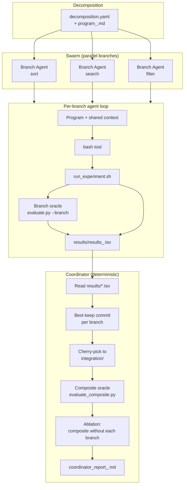

# TRANSMUTE-SWARM — Architecture

The core idea—an LLM agent that proposes code changes, runs experiments, and commits only on improvement—comes from [Karpathy’s autoresearch](https://github.com/karpathy/autoresearch). TRANSMUTE-SWARM extends it in two ways: (1) **multiple parallel branches** with a **deterministic composite oracle** and a **coordinator** that synthesizes results without an LLM, and (2) **more efficient single-agent iteration**—we reduced per-iteration tool chatter and token cost so each agent does more useful work per dollar. See [Single-agent efficiency](#single-agent-efficiency) below.

This document describes the core system and pipeline. For design rationale and tier philosophy, see [SWARM_DESIGN_V3.md](SWARM_DESIGN_V3.md).

---

## 1. Overview

TRANSMUTE-SWARM is a **tiered autonomous research system**: a problem is decomposed into branches, each branch is optimized in parallel by an LLM-driven agent, and a **deterministic coordinator** synthesizes results (best commits per branch, composite metric, ablation) without using an LLM. The **composite score** is the single source of truth.

- **Branches**: sort, search, filter (PoC). Each owns one solution file and one scalar metric (e.g. `sort_time_ms`).
- **Agents**: OpenRouter-based, tool-calling loop with a single `bash` tool; all edits and evaluation go through `run_experiment.sh`.
- **Coordinator**: Reads `results/results_<branch>.tsv`, picks best “keep” commit per branch, cherry-picks to an integration branch, runs composite oracle and ablation, writes `coordinator_report_<cycle>.md`.

### 1.1 Single-agent efficiency

Compared to the original autoresearch loop, we **improved the efficiency of each branch agent** so that one iteration costs fewer tool calls and fewer tokens:

- **Form-filling / single-call iteration**: In autoresearch, each iteration is many tool calls (edit file, `git commit`, run script, grep output, append to TSV). In TRANSMUTE-SWARM the agent does **one** `run_experiment.sh` call per iteration: the script runs the oracle, compares to best, commits only on improvement (or reverts), and appends the TSV row. The agent decides *what* to change; the script handles *how*. That cuts tool round-trips and prompt bloat—on the order of **~20–40% fewer tokens per iteration** and fewer latency spikes (see [SWARM_DESIGN_V3.md](SWARM_DESIGN_V3.md) and [improvements_discussion.md](improvements_discussion.md)).
- **Strict policy**: The agent is not allowed to call `evaluate.py`, `append_tsv.py`, or `git commit/reset/checkout` directly. All edits and evaluation go through `run_experiment.sh`, which enforces the single-call pattern and avoids wasted tool chatter.
- **Quick/full oracle**: A **quick** oracle run (fewer samples) is used for scouting; the script auto-promotes to **full** only when quick improves. That reduces wall-clock per experiment (e.g. **2–4× faster** scouting) while keeping final metrics unchanged.
- **TSV hygiene**: `append_tsv.py` normalizes commits and descriptions and owns the TSV schema, which saves prompt space and avoids bad rows that break the coordinator.

So we kept the core autoresearch idea (propose → run → commit only on improvement) but made each iteration cheaper and more deterministic.

---

## 2. Three-Tier Model (Summary)

| Tier | Role | Implementation |
|------|------|----------------|
| **Deterministic** | Ground truth: composite score | `oracles/evaluate_composite.py` (weighted sum of branch metrics). No LLM. |
| **Synthesis** | Interpret results, direct branches | PoC: human + coordinator report. Future: powerful model reading TSVs + discovery logs. |
| **Branch agents** | Explore sub-problems, report metrics | `agents/agent.py` + `run_experiment.sh` + oracles. Capable but cheap models. |

The composite is **lower-is-better** (e.g. weighted sum of times in ms). Branch oracles are fixed scripts; agents may not modify them.

---

## 3. Pipeline (End-to-End)

High-level flow:

1. **Decomposition** (human or future transmuter): define branches, owned files, per-branch metric and composite weights. Stored in `prompts/decomposition.yaml` and reflected in `prompts/programs/program_<branch>.md`.
2. **Swarm run**: For each branch, checkout `swarm/<run_tag>/<branch_id>`, run `agents/agent.py` for N iterations. Agent uses `run_experiment.sh` for every experiment; script runs oracle, compares to best, commits only on improvement, appends a row to `results/results_<branch>.tsv`.
3. **Coordinator run**: Read all `results/results_*.tsv`, select best keep-commit per branch, cherry-pick onto `integration/<run_tag>`, run composite oracle, run ablation (composite without each branch), write report.

Below is a **pipeline illustration** of the same flow.



**Single-branch experiment flow** (inside one agent run):

```mermaid
sequenceDiagram
  participant Agent
  participant Bash as bash tool
  participant RE as run_experiment.sh
  participant Oracle as evaluate.py
  participant Append as append_tsv.py
  participant TSV as results/results_<branch>.tsv

  Agent->>Bash: run_experiment.sh --branch sort --solution-path ... --mode quick ...
  Bash->>RE: invoke
  RE->>RE: Copy solution, run oracle (quick or full)
  RE->>Oracle: evaluate.py --branch sort --mode quick|full
  Oracle->>RE: sort_time_ms: <value>
  RE->>RE: Compare to best; if better → git commit
  RE->>Append: append_tsv.py branch commit metric status description log
  Append->>TSV: Append one row
  RE->>Bash: status=keep|discard|crash, metric=...
  Bash->>Agent: stdout/stderr
```

---

## 4. Core Components

### 4.1 Branch agent (`agents/agent.py`)

- **Inputs**: `--branch_id`, `--iterations`, `--run_tag`. Reads `prompts/programs/program_<branch_id>.md` and `discoveries/shared_context.md`.
- **Loop**: System prompt + program + shared context; user message “Begin experiment loop…”. Uses OpenRouter with one tool: `bash`. Primary/fallback models from `config/model_config.yaml` (fallback: `model_config.yaml` at repo root).
- **Policy**: Only read-only bash allowed outside `run_experiment.sh`. No direct calls to `evaluate.py`, `append_tsv.py`, or `git commit/reset/checkout`; no writing results files directly. All edits and evaluation go through a single `run_experiment.sh` invocation per iteration.
- **Done**: Agent replies `DONE` and summarizes when finished or at iteration limit.

### 4.2 Experiment runner (`run_experiment.sh`)

- **Role**: Single entry point for “edit solution → run oracle → record result”. Ensures consistent git and TSV handling.
- **Usage**: `run_experiment.sh --branch <sort|search|filter|finance> --solution-path <path> --mode <baseline|quick|full> --description <msg> --log <msg>`.
- **Modes**: `baseline` = record current HEAD as keep, no commit. `quick` = run oracle in quick mode; if better than best, re-run in full and then commit if still better. `full` = one full oracle run.
- **Flow**: Run branch oracle (or `evaluate_finance.py` for finance), parse metric, compare to best “keep” in TSV; if improved → `git add` + `git commit`, else revert file. Always append one row via `scripts/append_tsv.py` (commit may be `none` for discard/crash).
- **Outputs**: Writes to `results/results_<branch>.tsv` and `results/logs/<branch>.log`.

### 4.3 Branch oracles (`oracles/evaluate.py`, `evaluate_finance.py`)

- **Fixed**: Do not modify. They import the branch-owned solution from `solutions/` and produce a scalar.
- **evaluate.py**: `--branch sort|search|filter` plus `--mode quick|full`. Prints grep-parseable lines e.g. `sort_time_ms: <value>`, `input_size:`, `n_runs:`.
- **evaluate_finance.py**: Finance branch; outputs `finance_sharpe_neg` (or similar). Used when `--branch finance`.
- **evaluate_composite.py**: Runs all three (sort, search, filter) via subprocess, computes weighted sum. Prints `composite_ms:`, `sort_time_ms:`, etc. Weights match design (e.g. 1/3 each for PoC).

### 4.4 Coordinator (`agents/coordinator_script.py`)

- **Inputs**: `--run_tag`, `--branch_ids`, `--results_dir` (default `results/`), `--cycle`.
- **Steps**:
  1. Read `results/results_<branch>.tsv` for each branch; find best row with `status == keep` (lowest metric for that branch).
  2. Fetch branches, checkout `main`, create `integration/<run_tag>`, cherry-pick each best commit (skip on conflict).
  3. Run `oracles/evaluate_composite.py` on integration branch → composite score.
  4. Ablation: for each branch, build a tree with that branch omitted (main + other cherry-picks), run composite again; marginal = composite_without − composite_full (positive = branch helped).
  5. Write `coordinator_report_<cycle>.md` (best commits, composite, marginal table).
- **No LLM**: Pure Python + git + subprocess.

### 4.5 Supporting scripts

- **scripts/append_tsv.py**: Appends one TSV row to `results/results_<branch_id>.tsv` with correct header. Called only by `run_experiment.sh`.
- **scripts/probe_models.py**: Probes OpenRouter models (availability, tool use, instruction quality), writes `config/model_config.yaml` with primary/fallback. Loads `keys.env` from repo root.

### 4.6 Config and prompts

- **config/model_config.yaml**: Primary and fallback OpenRouter model IDs. Written by `scripts/probe_models.py`; read by `agents/agent.py` (tries `config/model_config.yaml` then repo root `model_config.yaml`).
- **config/transmutation_keys.md**: Institutional memory (PoC starts empty); design doc references it for future transmuter/coordinator.
- **prompts/decomposition.yaml**: Defines problem, composite metric, branches (id, owns, metric, oracle). PoC can be hand-written; future: transmuter output.
- **prompts/programs/program_<branch>.md**: Per-branch instructions (scope, goal, contract, how to run baseline and iterations, rules). Injected into agent system prompt.
- **discoveries/shared_context.md**: Shared findings for all branches (PoC starts empty). Future: filled by synthesis.

---

## 5. Data Artifacts

| Artifact | Location | Producer | Consumer |
|----------|----------|----------|----------|
| Branch results | `results/results_<branch>.tsv` | `run_experiment.sh` → `append_tsv.py` | Coordinator |
| Branch logs | `results/logs/<branch>.log` | `run_experiment.sh` | Human / debugging |
| Token usage | `results/token_usage.tsv` | (optional) | Analysis |
| Coordinator report | `coordinator_report_<cycle>.md` (repo root) | `coordinator_script.py` | Human |
| Model config | `config/model_config.yaml` | `scripts/probe_models.py` | `agents/agent.py` |

TSV columns (per branch): `commit`, `<metric>`, `memory_gb`, `status`, `description`, `log`. Only rows with `status == keep` are considered “best” by the coordinator.

---

## 6. CI (GitHub Actions)

- **Swarm Research** (`swarm.yml`): `workflow_dispatch` with `run_tag`, `branch_ids`, `iterations`. Creates `swarm/<run_tag>/<branch_id>` branches, runs `agents/agent.py` in parallel jobs (one per branch), pushes commits to swarm branches. Uploads `results_<branch_id>.tsv` as artifact per branch (artifact path may need to be `TRANSMUTE-SWARM/results/results_<branch_id>.tsv` if TSVs live under `results/`).
- **Coordinator** (`coordinator.yml`): Triggered by swarm completion (`workflow_run`) or manually with `swarm_run_id`. Downloads TSV artifacts from the swarm run into `results/`, runs `agents/coordinator_script.py`, uploads `coordinator_report_*.md` as artifact. For manual run, providing **Swarm workflow run ID** is required so the workflow can download that run’s artifacts.

---

## 7. Pipeline Summary Diagram (ASCII)

```
┌─────────────────────────────────────────────────────────────────────────────┐
│  DECOMPOSITION                                                               │
│  decomposition.yaml + prompts/programs/program_<branch>.md                   │
└───────────────────────────────────┬─────────────────────────────────────────┘
                                    │
        ┌───────────────────────────┼───────────────────────────┐
        ▼                           ▼                           ▼
┌───────────────┐           ┌───────────────┐           ┌───────────────┐
│ Branch: sort  │           │ Branch: search│           │ Branch: filter│
│ agent.py      │           │ agent.py      │           │ agent.py      │
│ → bash        │           │ → bash        │           │ → bash        │
│ → run_experim.│           │ → run_experim.│           │ → run_experim.│
└───────┬───────┘           └───────┬───────┘           └───────┬───────┘
        │                           │                           │
        │ evaluate.py               │ evaluate.py               │ evaluate.py
        │ --branch sort             │ --branch search           │ --branch filter
        ▼                           ▼                           ▼
┌───────────────┐           ┌───────────────┐           ┌───────────────┐
│ results/      │           │ results/      │           │ results/      │
│ results_sort  │           │ results_search│           │ results_filter│
│ .tsv          │           │ .tsv          │           │ .tsv          │
└───────┬───────┘           └───────┬───────┘           └───────┬───────┘
        │                           │                           │
        └───────────────────────────┼───────────────────────────┘
                                    ▼
                    ┌───────────────────────────────┐
                    │ COORDINATOR (no LLM)           │
                    │ 1. Best keep commit per branch │
                    │ 2. Cherry-pick → integration/  │
                    │ 3. evaluate_composite.py      │
                    │ 4. Ablation per branch        │
                    │ 5. coordinator_report_*.md    │
                    └───────────────────────────────┘
```

---

## 8. References

- [SWARM_DESIGN_V3.md](SWARM_DESIGN_V3.md) — Design rationale, tiers, transmuter, phase progression.
- [README.md](../README.md) — Quick start, structure, GitHub Actions summary.
