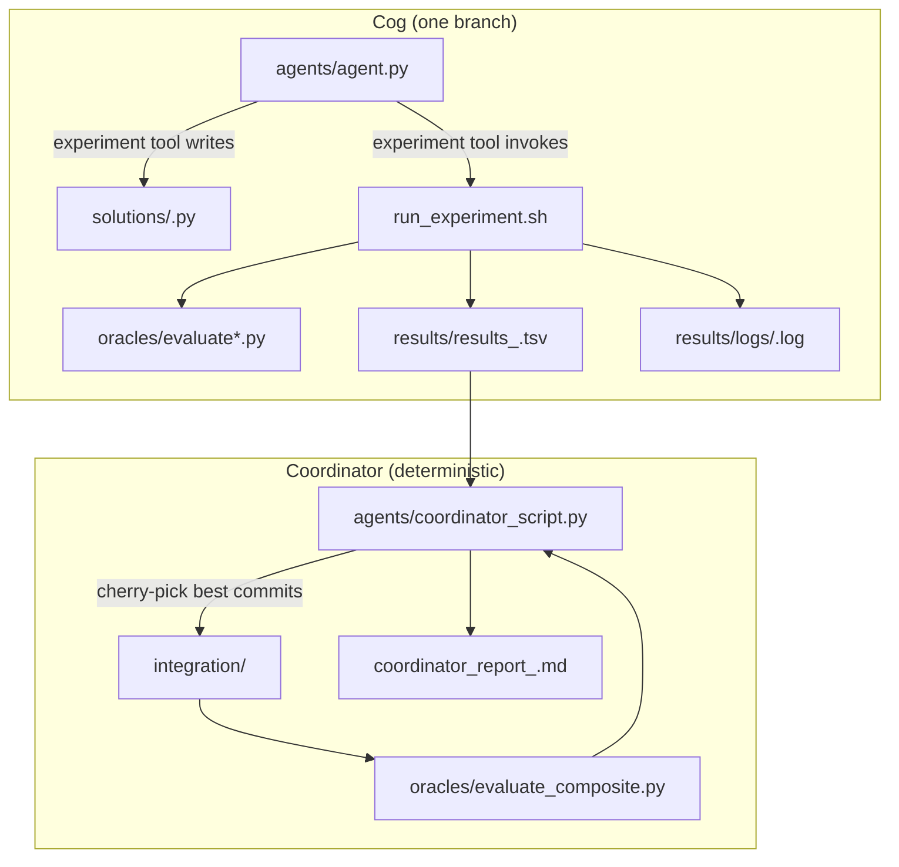

# TRANSMUTE-SWARM — Architecture (code-derived)

This document describes the system **as implemented in code** (agents, scripts, oracles, CI). It intentionally does not rely on other design docs.

## System in one paragraph

TRANSMUTE-SWARM runs multiple **Cog** agents in parallel (one per task/branch). Each Cog edits **exactly one** `solutions/<cog>.py` file, then runs a fixed oracle via `run_experiment.sh`. The harness records every attempt to `results/results_<cog>.tsv`, commits changes **only when the metric improves**, and reverts otherwise. After all Cogs finish, a deterministic `agents/coordinator_script.py` reads the TSVs, cherry-picks the best commits into `integration/<run_tag>`, runs the composite oracle, and produces an ablation report.

## Repository roles (what matters at runtime)

- **`agents/agent.py`**: Cog runner (OpenRouter tool-calling loop) that exposes only structured tools:
  - `experiment`: write solution code and run `run_experiment.sh`
  - `read_file`: read repo files (path validated)
  - `explore`: read-only shell exploration (heavily restricted)
- **`run_experiment.sh`**: the **only** supported path for oracle runs + git commit/revert + TSV append.
- **`oracles/`**: immutable evaluation harnesses.
  - `oracles/evaluate.py`: sort/search/filter timing oracle (quick/full)
  - `oracles/evaluate_finance.py`: finance oracle (negative Sharpe; lower is better)
  - `oracles/evaluate_composite.py`: composite oracle for sort/search/filter (weighted sum)
- **`agents/coordinator_script.py`**: deterministic synthesizer (no LLM): best-per-cog, cherry-pick, composite, ablation, report.
- **`scripts/append_tsv.py`**: TSV schema enforcement + append helper (invoked by `run_experiment.sh`).
- **`scripts/probe_models.py`**: probes OpenRouter models and writes `config/model_config.yaml`.

## Core invariants enforced by the implementation

- **Single-file ownership**: each Cog is supposed to own one solution file under `solutions/`.
- **Oracles are fixed**: oracle modules are intended to be immutable and treated as ground truth.
- **All experiments go through `run_experiment.sh`**:
  - direct calls to `evaluate*.py`, direct TSV writes, and direct git commit/reset/checkout are blocked for the agent loop (policy enforced by tool interface + `explore` restrictions).
- **Metric direction**: lower is better for all current branches (`*_time_ms`, `finance_sharpe_neg`).

## Data flow (end-to-end)

## The per-experiment contract (`run_experiment.sh`)

`run_experiment.sh` is responsible for:

- running the right oracle:
  - `python3 oracles/evaluate.py --branch sort|search|filter --mode quick|full`
  - `python3 oracles/evaluate_finance.py --mode quick|full` (when `--branch finance`)
- parsing the metric line (`<metric_name>:`),
- comparing the metric against **best keep so far** in `results/results_<branch>.tsv`,
- **committing** only when improved (or baseline mode),
- reverting the solution file when not improved or on crash,
- appending a TSV row through `scripts/append_tsv.py`,
- printing a small machine-parseable summary:
  - `status=keep|discard|crash`
  - `metric=<value>`
  - `best_before=...`
  - `best_after=...`
  - `commit=<shortsha|none>`

### Modes

- **baseline**: runs a full oracle evaluation, records a `keep` row for current `HEAD`, and does **not** create a commit.
- **quick**: runs a quick oracle; if it looks better than best, auto-promotes to a full run before deciding keep/discard.
- **full**: runs one full oracle evaluation.

## Results format (TSV)

Each Cog writes to `results/results_<cog_id>.tsv` with a branch-specific header:

- `commit`
- metric column (e.g. `sort_time_ms`, `finance_sharpe_neg`)
- `memory_gb` (currently written as `0.0` by the harness)
- `status` (`keep`, `discard`, `crash`)
- `description`
- `log`

The coordinator considers **only** rows where `status == keep`.

## Coordinator synthesis (`agents/coordinator_script.py`)

Given `--run_tag` and `--branch_ids ...`:

- reads each `results/results_<branch_id>.tsv`,
- finds the best (minimum) metric among `keep` rows,
- creates `integration/<run_tag>` from `main`,
- cherry-picks each best commit (skipping failures),
- runs the composite oracle (`oracles/evaluate_composite.py`) and captures `composite_ms`,
- performs **ablation**: recompute composite with each branch omitted; computes marginal contribution:

\[
\text{marginal}_{b} = \text{composite\_without}_{b} - \text{composite\_full}
\]

Positive marginal means that branch helped (removing it made composite worse / higher).

## CI mapping (GitHub Actions)

The implementation in `.github/workflows/` currently does:

- **`swarm.yml`**:
  - creates branches `cogs/<run_tag>/<cog_id>` using `agents/cog_manager.py create --push`
  - runs one parallel job per `cog_id`, checks out the corresponding `cogs/<run_tag>/<cog_id>` branch
  - runs `python3 agents/agent.py --branch_id <cog_id> --iterations <n> --run_tag <run_tag>`
  - uploads `results/results_<cog_id>.tsv` as an artifact
- **`coordinator.yml`**:
  - triggered on swarm completion (`workflow_run`) or manually (`workflow_dispatch`)
  - downloads `results-<cog_id>` artifacts into `results/` (preferred)
  - fallback: extracts TSVs from `origin/cogs/<run_tag>/<cog_id>:results/results_<cog_id>.tsv`
  - runs the coordinator and uploads `coordinator_report_*.md`

## Known implementation mismatches (worth fixing, but documented here)

- **Finance solution path mismatch in `agents/agent.py`**:
  - `BRANCH_SOLUTION_FILES["finance"]` points at `solutions/finance.py`, but the actual finance solution file is `solutions/finance_ma.py` (and `oracles/evaluate_finance.py` imports `finance_ma.py`).
- **Legacy “bash” language in Cog programs**:
  - `cogs/*/program.md` instructs running `bash run_experiment.sh ...`, but the agent loop uses the structured `experiment` tool, and the `explore` tool explicitly blocks invoking `run_experiment.sh` directly.
- **Composite vs decomposition**:
  - `config/decomposition.yaml` currently describes only `finance`, but `oracles/evaluate_composite.py` is hard-coded for sort/search/filter weights. Treat them as separate PoCs unless/until unified.

